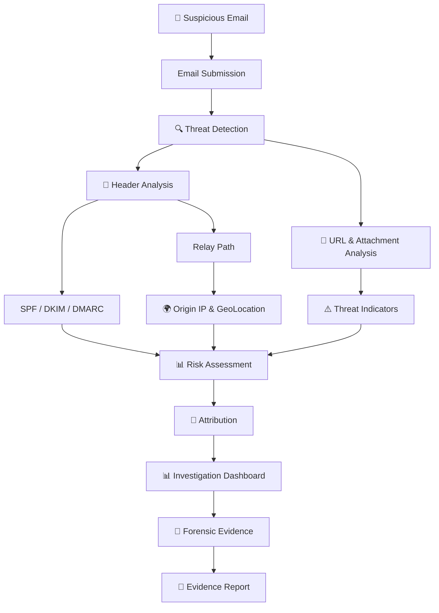
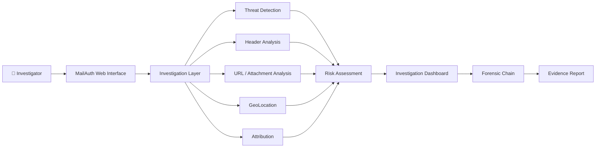
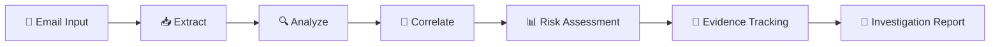

# MailAuth

## Email Threat Intelligence & Fraud Investigation Platform.

MailAuth is an email threat investigation platform designed to analyze suspicious emails through multiple security, network, and forensic signals.
The platform combines email detection, header analysis, geolocation, attribution, risk assessment, and forensic evidence tracking into a unified investigation workflow.
## Problem Statement

AI-Powered Email Threat Detection,Geolocation and Forensic Intelligence Platform.

## Proposed Solution

MailAuth provides a centralized investigation workflow that combines multiple signals from a suspicious email and presents them through an analyst-friendly interface.

The platform aims to answer:

> **Why is this email suspicious, where did it originate, what other signals are connected to it, and what evidence was generated during the investigation?**

## Key Features

### 1. 🔍 Email Threat Detection

MailAuth allows an investigator to submit a suspicious email for analysis.

The detection module collects and analyzes:

- Sender
- Recipient
- Subject
- Email content
- Detected URLs
- Attachments
  
### 2. 📧 Header Analysis

MailAuth analyzes email header information to identify authentication and routing-related signals.

The module examines:

- SPF(Sender Policy Framework)
- DKIM(Domainkeys Identified Mail)
- DMARC(Domain-based Message Authentication, Reporting, and Conformance)
- Return-Path
- Reply-To
- Message ID
- Sending IP
- Relay path

These signals help investigators understand how the email was authenticated and how it travelled through mail servers.

### 3. 🌍 GeoLocation

MailAuth uses the originating IP address to provide approximate network-level geographical context during an investigation.

The module can display:

- Origin IP address
- Country
- Approximate city/location
- Internet Service Provider (ISP)
- Autonomous System Number (ASN)
- Location visualization

Geolocation is used as a supporting investigation signal and should not be treated as proof of the sender's identity.

### 4. 🔗 Attribution

MailAuth correlates suspicious emails using shared technical indicators to identify possible relationships between messages.

The module can compare signals such as:

- Shared domains
- Shared IP addresses
- Common URLs
- Email infrastructure
- Other observable technical indicators

Related emails can then be grouped to help investigators understand whether multiple messages may be connected to the same campaign or infrastructure.

> Attribution represents technical correlation and does not by itself prove the identity of the sender or attacker.

### 5. 📊 Investigation Dashboard

MailAuth provides a centralized dashboard where investigators can view the overall results of an email investigation.

The dashboard summarizes important information such as:

- Investigation status
- Threat and risk level
- Detected suspicious indicators
- Email authentication results
- Origin and infrastructure information
- Related email activity
- Recent investigation alerts

This gives investigators a single view of the evidence collected during the investigation.

### 6. 🔗 Forensic Chain & Evidence Report

MailAuth maintains a structured record of the evidence collected during an investigation.

The forensic module records:

- Investigation timeline
- Evidence details
- Evidence identifiers
- Hash values
- Previous-record references
- Threat assessment results
- Investigation actions

The collected information can be organized into an evidence report to help investigators review and document the investigation process.

## 🔄 Investigation Workflow

MailAuth follows a structured investigation workflow to analyze suspicious emails and organize the collected evidence.

##🏗️ System Architecture

MailAuth is organized into multiple investigation modules that work together to analyze suspicious emails, correlate technical signals, assess risk, and generate evidence.

> The forensic chain is designed to support evidence traceability and maintain a clear investigation history.

##Technology Stack

### Frontend
- HTML5
- CSS3
- JavaScript

### Backend
- Python
- Flask / FastAPI
- REST API

### Email Analysis
- Email Header Parsing
- MIME / Email Content Parsing
- SPF Analysis
- DKIM Analysis
- DMARC Analysis

### Threat Detection
- URL Analysis
- Domain Analysis
- Attachment Analysis
- Phishing Indicator Detection
- Suspicious Pattern Detection

### Network Intelligence
- IP Address Analysis
- IP Geolocation
- ASN / ISP Lookup
- Domain and Infrastructure Correlation

### Risk Assessment
- Rule-Based Risk Scoring
- Indicator Correlation
- Threat Severity Classification

### Digital Forensics
- Investigation Timeline
- Evidence Hashing
- Evidence Traceability
- Chain of Custody

### Reporting
- Automated Evidence Report Generation
- Investigation Summary

### Development & Deployment
- GitHub
- GitHub Pages
- REST APIs

## ⚙️ Investigation Pipeline

MailAuth processes a suspicious email through the following pipeline:

## 📌 Project Status

### Currently Demonstrated
- Email threat investigation interface
- Email threat detection workflow
- Header analysis interface
- SPF / DKIM / DMARC analysis workflow
- IP and GeoLocation visualization
- Attribution and indicator correlation workflow
- Investigation dashboard
- Forensic evidence tracking
- Evidence report workflow

### Planned Backend Integration
- Real email parsing
- Automated SPF / DKIM / DMARC verification
- URL and attachment scanning
- IP and domain threat intelligence
- Automated risk scoring
- Evidence report generation
- Persistent investigation storage

## 🚀 Future Scope

MailAuth can be extended with additional capabilities to improve automated email threat investigation.

- 🤖 AI-assisted phishing and fraud detection
- 🔎 Real-time threat intelligence integration
- 🌐 Domain reputation and URL analysis
- 📎 Advanced attachment malware analysis
- 🧠 Machine learning-based risk scoring
- 🔗 Advanced campaign and infrastructure correlation
- 🗄️ Secure investigation history and case management
- 📄 Automated forensic report generation
- 🔔 Real-time threat alerts
- 👥 Multi-user investigator and case management
- Suspicious indicators
The system then provides an investigation progress view and a threat/risk assessment based on the available signals.

## 🖥️ Prototype Interface

